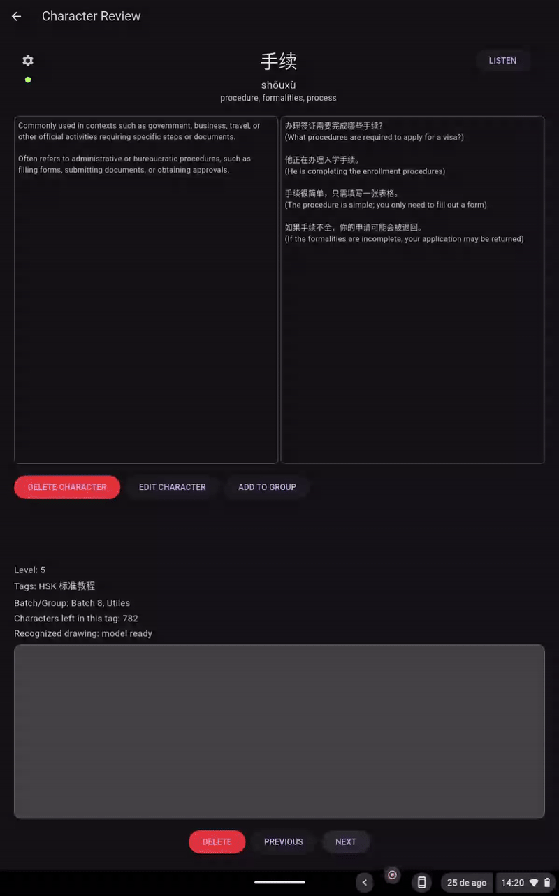

# HanziApp

A Flutter application to review Chinese characters (hanzi). The home screen exposes buttons that navigate to screens for managing and practicing character groups and batches.

## Features

- Organize characters into custom groups and practice batches.
- Handwriting input powered by Google's ML Kit Digital Ink Recognition.
- Offline mode on Android with automatic synchronization when connectivity returns.
- Simple Flask backend with token-based authentication and SQLite storage.
- Cross-platform support for Android, web, and desktop targets.




## Installation and Deployment

### Environment setup

1. [Install Flutter](https://docs.flutter.dev/get-started/install) on your machine.
2. Ensure the Flutter SDK is available in your `PATH`. One way to obtain Flutter is:
   ```bash
   git clone https://github.com/flutter/flutter.git -b stable $HOME/flutter
   export PATH="$HOME/flutter/bin:$PATH"
   flutter --version
   ```

### Running the app

From this repository root run:
```bash
flutter pub get
flutter run -d chrome   # or choose your connected device
```

The app targets mobile and web platforms. The backend API URL and authentication token used by the Flutter code are defined in `lib/api/api_config.dart`. Update this file when deploying the backend to a different host.

### Backend service
Build and run the Flask API with Docker Compose:
```bash
docker-compose up --build
```

The container stores the SQLite database in a `db/` directory at the project root which is mounted into the container at `/data`. The backend reads the path from the `DB_PATH` environment variable (default `/data/hanzi.db`) so the data persists across restarts. When the service starts it automatically creates any missing tables in the database.

To create the database from `data.json`, run:
```bash
./backend/create_db.sh
```
This will generate `db/hanzi.db` which is used by the Docker container and the backup scripts.

#### Backup and restore

Use the helper scripts in `backend/` to export or import the entire database as JSON. Run them from the host machine and point them at the database file under `db/`:
```bash
# Export all tables to backup.json
python backend/export_data.py backup.json db/hanzi.db

# Import all tables from a JSON file
python backend/import_data.py backup.json db/hanzi.db
```
These scripts automatically create any missing tables in the database and honor the `DB_PATH` environment variable to locate the SQLite file.

### Android build

An `android/` folder is included so the project can be compiled for Android devices. After fetching the dependencies you can build the APK with:
```bash
flutter build apk --release
```

The app relies on Google's ML Kit Digital Ink Recognition via the `google_mlkit_digital_ink_recognition` package to process handwritten characters.

